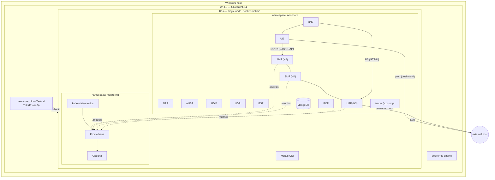

# NeonCore 5G

A private 5G standalone (SA) core testbed — [Open5GS](https://open5gs.org/) core network
functions + [UERANSIM](https://github.com/aligungr/UERANSIM) simulated gNB/UE — deployed on a
single-node [K3s](https://k3s.io/) cluster inside WSL2, with Prometheus/Grafana monitoring,
automated packet-trace capture, and a neon terminal control center to drive all of it.

> Built phase-by-phase (bare-metal validation → Kubernetes → observability → tracing → CLI →
> docs). The full engineering log — every bug hit and how it was fixed — lives in
> [`DEVLOG.md`](DEVLOG.md). This document is the "how do I run this" guide.

## Table of contents

- [Architecture](#architecture)
- [Prerequisites](#prerequisites)
- [Setup](#setup)
- [Deploying the stack](#deploying-the-stack)
- [Using the CLI](#using-the-cli)
- [Scenario automation](#scenario-automation)
- [Monitoring](#monitoring)
- [Network tracing](#network-tracing)
- [Project structure](#project-structure)
- [Known limitation: WSL2 clock drift](#known-limitation-wsl2-clock-drift)
- [Troubleshooting](#troubleshooting)

## Architecture



**Layers, bottom to top:**

1. **WSL2** hosts everything — a native `docker-ce` engine and a single-node K3s cluster that
   uses that same Docker engine as its container runtime (`--docker` install flag), per the
   original spec.
2. **Multus CNI** rides alongside K3s's default Flannel network, enabling secondary interfaces
   (macvlan/ipvlan) for pods that need them — validated in Phase 1, available for future RAN
   scaling but not required by the current NF topology (all NFs talk over the default pod
   network).
3. **`neoncore` namespace** — the 5G core itself:
   - **NRF** (discovery hub all other NFs register with) → **AUSF** (5G-AKA auth) → **UDM/UDR**
     (subscriber data, backed by **MongoDB**) → **PCF** (policy, requires **BSF** for
     `nbsf-management` binding) → **AMF** (N1/N2 — registration, mobility) → **SMF** (N4/PFCP
     session control) → **UPF** (N3/GTP-U — actual user-plane data forwarding + NAT to the
     outside world).
   - **gNB** and **UE** (UERANSIM) simulate the radio side: gNB speaks NGAP/SCTP to AMF (N2) and
     GTP-U to UPF (N3); UE attaches through gNB and gets a PDU session, surfacing as a
     `uesimtun0` tunnel interface inside the UE pod.
   - **tracer** captures packets from all of the above (see [Network tracing](#network-tracing)).
4. **`monitoring` namespace** — Prometheus scrapes native Open5GS metrics (AMF/SMF/UPF/PCF only —
   see [Monitoring](#monitoring)) plus Kubernetes-level pod health via kube-state-metrics;
   Grafana visualizes both.
5. **The CLI** (`neoncore_cli`, Phase 5) is just a `kubectl` wrapper with a nice face — deploy,
   teardown, live pod health, UE ping tests, and trace summaries, all from one terminal.

Why K3s over kind/minikube, why docker-ce over Docker Desktop integration, and every bug hit
building each layer — see [`DEVLOG.md`](DEVLOG.md).

## Prerequisites

- **Windows 10/11** with WSL2 enabled, running an **Ubuntu 24.04** ("noble") distro.
  - Recommend 10GB+ WSL2 memory allocation (`.wslconfig`) if your host has the headroom; this
    project was built and validated on the WSL2 default (~6.2GB) with careful resource checks
    at each step, but more headroom leaves less to worry about.
- **`sudo` access** inside that WSL2 distro — several setup steps (installing packages, loading
  kernel modules, installing K3s) need it, and none of it can be done non-interactively from an
  automated session (no cached credentials, no TTY) — you run these yourself, once.
- **systemd enabled in WSL2** (`/etc/wsl.conf` → `[boot]` → `systemd=true`, then `wsl --shutdown`
  from PowerShell and reopen) — required for both docker-ce and K3s to run as proper services.
- **Python 3** (ships with Ubuntu 24.04) — for the Phase 5 CLI.

Everything else — docker-ce, K3s, Multus, kernel modules, Python's venv support — is installed
by the scripts in `setup/` (next section).

## Setup

Run these **in order**, each in a normal terminal (not through an AI agent — they need `sudo`
and a real TTY):

```bash
# 1. Docker engine (native docker-ce, not Docker Desktop's WSL integration)
bash ~/neoncore-5g/setup/install-docker.sh
# → log out and back into WSL2 (or `newgrp docker`) so your user's new docker group applies

# 2. SCTP kernel module — required for AMF's N2 (NGAP) interface to gNB
bash ~/neoncore-5g/setup/enable-sctp.sh

# 3. Kernel modules K3s/Multus need: iptable_nat, macvlan, ipvlan
bash ~/neoncore-5g/setup/prepare-k3s-kernel-modules.sh

# 4. K3s itself (single node, Docker runtime, Traefik/ServiceLB disabled)
bash ~/neoncore-5g/setup/install-k3s.sh

# 5. Python venv support, for the CLI
bash ~/neoncore-5g/setup/install-python-venv.sh
```

After step 4, `kubectl` needs one more thing that the script doesn't (and can't) persist across
new shells on its own:

```bash
echo 'export KUBECONFIG=$HOME/.kube/config' >> ~/.bashrc && source ~/.bashrc
```

(K3s's bundled `kubectl` — it's actually a symlink to the `k3s` binary — defaults to
`/etc/rancher/k3s/k3s.yaml`, which is root-only. See
[Troubleshooting](#gotcha-kubectl-permission-denied--kubeconfig-not-picked-up).)

Then deploy Multus (one-time cluster setup, not part of the app-level deploy/teardown cycle):

```bash
kubectl apply -f ~/neoncore-5g/phase1/multus-helmchart.yaml
kubectl -n kube-system get pods -l app=rke2-multus   # wait for Running
```

Verify everything's in place:

```bash
docker --version && docker ps                 # docker engine works
kubectl get nodes                              # should show your node Ready
kubectl -n kube-system get pods                # multus pod Running
lsmod | grep -E 'sctp|iptable_nat|macvlan|ipvlan'   # all four loaded
```

## Deploying the stack

**Preferred: through the CLI** (see [Using the CLI](#using-the-cli) below) — launch it and press
`d`.

**Or directly with `kubectl`**, applying manifests in this order:

```bash
cd ~/neoncore-5g
for f in phase2/manifests/00-namespace.yaml \
         phase2/manifests/01-configmaps.yaml \
         phase2/manifests/02-mongo.yaml; do kubectl apply -f "$f"; done
kubectl -n neoncore wait --for=condition=Ready pod -l app=mongo --timeout=90s
for f in phase2/manifests/03-nfs.yaml \
         phase2/manifests/04-dbctl-job.yaml \
         phase2/manifests/05-ueransim.yaml \
         phase3/manifests/*.yaml \
         phase4/manifests/*.yaml; do kubectl apply -f "$f"; done
```

(Skip any `phase3/manifests/dashboards/*.yaml`-adjacent files that aren't real manifests — the
`phase3/manifests/*.yaml` glob only matches the numbered top-level files, which is what you
want; `dashboards/` holds the raw JSON/provisioning files those manifests embed.)

Check it came up:

```bash
kubectl -n neoncore get pods
kubectl -n monitoring get pods
```

You should see ~13 pods in `neoncore` (mongo, dbctl [Completed], nrf, ausf, udm, udr, bsf, pcf,
amf, smf, upf, gnb, ue, tracer) and 3 in `monitoring` (prometheus, grafana, kube-state-metrics),
all `Running` (dbctl is a one-shot Job — `Completed` is correct, not stuck).

**Teardown** (removes everything in both namespaces, including the packet-trace PVC):

```bash
kubectl delete namespace neoncore monitoring
```

## Using the CLI

```bash
bash ~/neoncore-5g/phase5/run.sh
```

First run builds a `.venv` and installs [Textual](https://textual.textualize.io/) automatically
(needs `python3-venv` from Setup step 5). Subsequent runs reuse it.

```
┌──────────────────────────────────────────────────────────────────────┐
│              ▓▒░  N E O N C O R E   5 G  ░▒▓                         │
│   Kubernetes 5G Core Control Center — press a key below to act       │
├───────────────────────────────┬────────────────────────────────────┤
│  5G CORE // POD STATUS         │  ACTION LOG                        │
│  ┌───┬─────┬─────────┬───┬──┐  │  NeonCore 5G Control Center online.│
│  │NS │POD  │STATUS   │RDY│..│  │  d=deploy  t=teardown  p=ping ...  │
│  ├───┼─────┼─────────┼───┼──┤  │                                    │
│  │..│amf  │Running  │1/1│..│  │  === UE CONNECTION TEST ===        │
│  │..│upf  │Running  │1/1│..│  │  Running ping from UE pod ...      │
│  │..│ue   │Running  │1/1│..│  │  64 bytes from 8.8.8.8: ...         │
│  └───┴─────┴─────────┴───┴──┘  │                                    │
├───────────────────────────────┴────────────────────────────────────┤
│  13/13 pods Running — last refresh just now                          │
└──────────────────────────────────────────────────────────────────────┘
```

| Key | Action |
|---|---|
| `d` | Deploy the full stack (phase2 + phase3 + phase4 manifests, in the correct order) — asks for confirmation first |
| `t` | Teardown (`kubectl delete namespace neoncore monitoring`) — asks for confirmation first, **destroys the packet-trace PVC too** |
| `p` | UE connection test — `kubectl exec` a `ping -I uesimtun0 -c 4 8.8.8.8` inside the live UE pod |
| `l` | Latest network traces — lists recent PCAP files from the tracer pod + a protocol summary of the newest one |
| `s` | Run a 5G signaling scenario (see [Scenario automation](#scenario-automation) below) — asks for MSISDN + policy params first |
| `c` | Start/stop a manual packet capture (toggle) — see [Network tracing](#network-tracing) below |
| `r` | Force an immediate pod-table refresh (it also auto-refreshes every 4s) |
| `q` | Quit |

Scope note: "deploy/teardown the Kubernetes infrastructure" here means the **NeonCore
workload** (`neoncore` + `monitoring` namespaces) — not K3s itself. Tearing down K3s/Multus is a
much more systemic, harder-to-reverse operation than an app-level CLI should own; that stays a
manual step (re-run `setup/install-k3s.sh`'s uninstall counterpart, `/usr/local/bin/k3s-uninstall.sh`,
if you ever need to).

## Scenario automation

`phase6/` drives real 5G signaling procedures against the live core, with a fresh, uniquely-named
pcap capture per run. Each spins up a short-lived UE pod (never the long-lived `ue` Deployment's
pod, so it never disturbs the CLI's ping test), applies whatever subscriber policy you gave it,
and cleans itself up afterward:

| Scenario | What it proves | Trigger |
|---|---|---|
| `initial-registration` | A provisioned IMSI attaches successfully | none — just attach |
| `registration-reject` | An unprovisioned IMSI is rejected by the network | none — IMSI is deliberately never provisioned |
| `deregistration` | UE-initiated deregistration cascades to SMF releasing the PDU session | `nr-cli <imsi> --exec "deregister normal"` after initial attach |

Via the TUI: press `s`, enter a 10-digit MSISDN (IMSI = `99970<msisdn>`) and optional policy
overrides (5QI, ARP priority, AMBR up/down — the same fields Open5GS/PCF derive default policy
from), then pick a scenario button.

Directly, for one-off runs or scripting:
```bash
python3 -m phase6.cli --scenario initial-registration --msisdn 0000000100
```

Or the full integration suite (sequential, live-cluster, no extra dependencies):
```bash
python3 -m phase6.tests.run_scenarios
```

Each run's pcap lands in `traces/scenario-runs/<scenario>-<msisdn>-<timestamp>.pcap` (gitignored —
every run produces one; promote a specific capture into `traces/` manually if it's worth keeping,
the way `traces/rogue-ue-reject.pcap` was).

**Not implemented: handover and Tracking Area Update.** Both were dropped after live research
showed UERANSIM (the RAN/UE simulator this project uses) doesn't actually implement the underlying
procedure — not a gap in this automation. See `phase6/scenarios.py`'s module docstring and
`DEVLOG.md`'s Phase 7 section for the upstream issues confirming this.

## Monitoring

- **Grafana**: http://localhost:30030 (admin / `neoncore`, or continue anonymously — anonymous
  admin access is enabled for local-dev convenience; see
  [Hardening for anything beyond local dev](#hardening-for-anything-beyond-local-dev) before
  exposing this anywhere else). Pre-provisioned dashboard: **NeonCore 5G** — pod health/restarts,
  AMF registrations, SMF PDU session establishment, UPF sessions + N3 GTP-U packet rate, PCF
  policy associations, per-NF memory.
- **Prometheus**: http://localhost:30090 — raw metrics/PromQL if you want to dig deeper than the
  dashboard.

Both are NodePort services; WSL2's default localhost-forwarding means these URLs should work
directly from a Windows browser too, not just inside the WSL2 shell.

**Only AMF, SMF, UPF, and PCF export native Open5GS metrics** — NRF/AUSF/UDM/UDR/BSF don't
implement the metrics HTTP server at all in this build. This isn't a misconfiguration; see
`DEVLOG.md`'s Phase 3 section for how this was confirmed.

## Network tracing

A single `tracer` pod (Phase 4) runs `tcpdump -i any` with `hostNetwork: true` on the K3s node,
capturing N2 (SCTP/NGAP), N4 (PFCP), N3 (GTP-U), SBI (HTTP/2), and ICMP traffic — one capture
point sees all pod-to-pod traffic since this is single-node. Files rotate every 5 minutes or
50MB, get gzip'd, and anything older than 2 hours is auto-deleted. They live on a 5Gi
PersistentVolume, so they survive pod restarts.

```bash
# List recent captures
TRACER_POD=$(kubectl -n neoncore get pods -l app=tracer -o jsonpath='{.items[0].metadata.name}')
kubectl -n neoncore exec "$TRACER_POD" -- ls -la /pcaps

# Pull one to your machine for deeper analysis (e.g. in Wireshark)
kubectl -n neoncore cp "neoncore/$TRACER_POD:/pcaps/<filename>.pcap.gz" ./capture.pcap.gz
```

Or just press `l` in the CLI for a quick summary without leaving the terminal.

**Manual capture (CLI `c` key):** starts a second, independent `tcpdump` on the same tracer pod —
same filter, doesn't disturb the continuous background capture above — that you control by hand:
press `c` to start, do whatever you want to trace (a manual test, a one-off `kubectl exec`, etc.),
then press `c` again to stop. On stop it's health-checked (confirms the file actually grew, not
just that the process stayed alive) and copied to `traces/manual/<name>.pcap` locally. Distinct
naming (`manual-<timestamp>.pcap`) keeps it apart from both the tracer's own rotated files and
phase6's per-scenario captures.

## Project structure

```
neoncore-5g/
├── README.md              this file
├── DEVLOG.md              full phase-by-phase engineering log (bugs, deviations, decisions)
├── setup/                 one-time, sudo-requiring host setup scripts (run these yourself)
├── phase0/                docker-compose bare-metal validation (Open5GS + UERANSIM, no K8s)
│   ├── docker-compose.yaml
│   ├── configs/           Open5GS NF configs — shared source for Phase 2's ConfigMaps too
│   └── scripts/           subscriber provisioning, verification
├── phase1/                K3s + Multus artifacts (HelmChart manifest, test NAD)
├── phase2/manifests/      the 5G core + RAN as Kubernetes Deployments/Services
├── phase3/manifests/      Prometheus + Grafana + kube-state-metrics
├── phase4/manifests/      the packet tracer (PVC, ConfigMap script, Deployment)
├── phase5/                the Textual CLI (neoncore_cli/), smoke test, launcher
└── phase6/                5G signaling-scenario automation (initial registration,
                           registration reject, deregistration) + integration tests,
                           driven from the CLI's `s` key -- see DEVLOG.md's Phase 7
```

## Known limitation: WSL2 clock drift

`dmesg` on this host shows repeated `systemd-journald: Time jumped backwards, rotating.` every
~5-50 seconds — Windows periodically suspends/resumes the WSL2 VM, and its clock drifts on
resume. This breaks UERANSIM's timer-based radio-link-simulation keepalives: the gNB↔UE radio
link flaps continuously, which makes sustained data-plane traffic (e.g. a long ping through
`uesimtun0`) unreliable, even though control-plane signaling (NG Setup, registration, PDU
session establishment) mostly still succeeds in the calm windows between drift events.

This was root-caused (not just observed) by cross-referencing `dmesg` timing against gNB log
flapping and a `tcpdump` on UPF showing zero GTP-U packets arriving during a failed ping — see
`DEVLOG.md` Phase 0/2 for the full trace. **It's a host-level issue, not a bug in any manifest
here.**

**Status: fix applied** — `C:\Users\marlo\.wslconfig` now has:

```ini
[wsl2]
vmIdleTimeout=-1
```

This stops Windows from suspending the idle VM, which is the probable drift trigger. Takes
effect after `wsl --shutdown` (from PowerShell) + reopening WSL2 — `docker` and `k3s` are both
enabled systemd services, so the cluster comes back up on its own, no manual restart needed.
Everything through Phase 5 was built and verified *without* this fix in place (i.e., the harder
case); if drift symptoms (see `dmesg` for `Time jumped backwards`) reappear after a Windows
update or similar, this is the first thing to re-check.

## Troubleshooting

### Multus

**Multus pod stuck `CrashLoopBackOff` or never leaves `ContainerCreating`**
Check `kubectl -n kube-system logs -l app=rke2-multus`. The most common cause on K3s is CNI
path mismatches: K3s does **not** use the standard `/opt/cni/bin` /
`/etc/cni/net.d` paths that plain upstream Multus manifests assume — it uses
`/var/lib/rancher/k3s/data/cni/` and `/var/lib/rancher/k3s/agent/etc/cni/net.d`. If you deployed
Multus by any means other than `phase1/multus-helmchart.yaml` (which sets these explicitly),
that's the first thing to check. Verify the actual paths on the node:
```bash
ls /var/lib/rancher/k3s/data/cni/        # should include: multus, macvlan, ipvlan, bridge, ...
ls /var/lib/rancher/k3s/agent/etc/cni/net.d/
```

**A pod with a `NetworkAttachmentDefinition` annotation doesn't get the secondary interface**
- Check the annotation matches the NAD's name (and namespace, if different):
  `k8s.v1.cni.cncf.io/networks: <nad-name>` or `<namespace>/<nad-name>`.
- Check `kubectl describe pod <pod>` for CNI errors in the Events section.
- Check the `k8s.v1.cni.cncf.io/network-status` annotation on the running pod — it lists every
  interface Multus actually attached; if your NAD's network isn't listed, the attach silently
  failed.

**macvlan/ipvlan-specific: "no such network interface" or the interface never comes up**
- The `master` interface named in your NAD's CNI config (e.g. `eth0`) must actually exist on the
  node — check with `ip addr` on the K3s node itself, not inside a pod.
- The `macvlan`/`ipvlan` kernel modules must be loaded: `lsmod | grep -E 'macvlan|ipvlan'`. If
  missing, re-run `setup/prepare-k3s-kernel-modules.sh`.
- General macvlan gotcha (not specific to this project): a macvlan interface's parent NIC can't
  usually talk directly to child macvlan interfaces from the *host* itself, only from other
  hosts/interfaces on the same L2 segment — if you need host↔pod connectivity over a macvlan
  network, you typically need a separate macvlan interface on the host bridged appropriately.

### Docker / networking

**AMF pod runs fine, but gNB never completes NG Setup / connection refused on port 38412**
SCTP kernel module isn't loaded. `lsmod | grep sctp` — if empty, `sudo modprobe sctp`, or re-run
`setup/enable-sctp.sh`. Also check `find /lib/modules/$(uname -r) -iname 'sctp.ko*'` — if that
comes back empty, your WSL2 kernel build genuinely lacks SCTP support (unusual, but possible on
custom kernels) and there's no software fix.

**UPF `CrashLoopBackOff` with `ioctl(TUNSETIFF): Operation not permitted`**
The Open5GS image runs as non-root; `NET_ADMIN` alone often isn't enough for a non-root process
to create the `ogstun` TUN device (Linux ambient capabilities don't propagate across `exec` by
default). In docker-compose this needed `privileged: true`; in Kubernetes, `runAsUser: 0` +
`capabilities.add: [NET_ADMIN]` + a `hostPath` mount of `/dev/net/tun` was sufficient (see
`DEVLOG.md` Phase 0 vs Phase 2 for exactly why K8s needed less). If you've customized the
manifests and hit this, check both the security context **and** the `/dev/net/tun` mount are
present together — missing either one reproduces this error.

**SCTP-based `Service` (e.g. AMF) isn't reachable, or gNB gets inconsistent connection behavior
through a ClusterIP**
This WSL2 kernel has no `nf_conntrack_proto_sctp` module (`find /lib/modules/$(uname -r) -iname
'nf_conntrack_proto_sctp*'` comes back empty), so kube-proxy's iptables-based SCTP proxying for a
normal `ClusterIP` Service is unreliable. All Services in `phase2/manifests/` are headless
(`clusterIP: None`) specifically to avoid this — DNS returns the pod's real IP directly, bypassing
kube-proxy/iptables entirely. If you add a new SCTP-speaking Service, make it headless too.

**`kubectl exec`/logs work but `kubectl get pods` is empty or `kubectl` hangs waiting on the API server**
Check the K3s service is actually up: `systemctl is-active k3s`. If it's not `active`,
`sudo systemctl start k3s` and check `sudo journalctl -u k3s -n 50` for why it didn't start
(common: another process already bound to port 6443, or a stale lock from a previous crash).

**`docker: command not found`, or `docker ps` needs `sudo` every time**
If Docker Desktop's WSL integration was ever partially enabled and then native docker-ce was
installed on top, you can end up with two docker CLIs/contexts fighting each other. Check
`which docker` and `docker context ls`; this project assumes native docker-ce only (see
`setup/install-docker.sh`), not Docker Desktop integration. If `docker ps` needs `sudo`, your
user probably isn't in the `docker` group yet, or you haven't logged out/back in since
`usermod -aG docker $USER` ran — `groups` should list `docker`.

### `kubectl`

#### Gotcha: `kubectl` "permission denied" / `KUBECONFIG` not picked up

K3s symlinks `/usr/local/bin/kubectl` to the `k3s` binary itself (`k3s kubectl ...`). Unlike
stock `kubectl`, this wrapper does **not** fall back to `~/.kube/config` — it hardcodes
`/etc/rancher/k3s/k3s.yaml`, which is root-only (mode 600). If you see:
```
error: error loading config file "/etc/rancher/k3s/k3s.yaml": open /etc/rancher/k3s/k3s.yaml: permission denied
```
run `echo $KUBECONFIG` — if it's empty, that's why. Fix (see Setup step 4's follow-up):
```bash
echo 'export KUBECONFIG=$HOME/.kube/config' >> ~/.bashrc && source ~/.bashrc
```

### Resources

**Pods stuck `Pending`, or things generally start behaving strangely under load**
Run `free -h`. This project was built against a ~6.2GB WSL2 memory cap; if `available` drops
below ~1-2GB, expect instability. Options: increase the WSL2 memory allocation (see
`.wslconfig` under [Known limitation](#known-limitation-wsl2-clock-drift) — you can set `memory=`
in the same file), or reduce what's running (e.g., `kubectl delete namespace monitoring` if
you're not actively watching dashboards).

### Hardening for anything beyond local dev

This project is built for local, single-user WSL2 development — several defaults intentionally
prioritize convenience over security and should **not** ship as-is anywhere with real users or
network exposure:
- Grafana: anonymous Admin access is on (`GF_AUTH_ANONYMOUS_ENABLED=true`,
  `GF_AUTH_ANONYMOUS_ORG_ROLE=Admin`) and the admin password is a hardcoded default
  (`phase3/manifests/06-grafana.yaml`).
- The tracer pod runs `privileged: true` with `hostNetwork: true` — appropriate for a single-node
  dev capture point, not for a shared or multi-tenant cluster.
- UPF runs as root (`runAsUser: 0`) with `NET_ADMIN`.
- MongoDB has no authentication configured.

## Credits

- [Open5GS](https://open5gs.org/) — the 5G core implementation.
- [UERANSIM](https://github.com/aligungr/UERANSIM) — the gNB/UE simulator.
- [Gradiant](https://github.com/Gradiant/5g-images) — the `open5gs` and `ueransim` container
  images this project builds on, and the `rke2-multus` Helm chart used for Multus on K3s.
- [Textual](https://textual.textualize.io/) — the TUI framework behind the Phase 5 CLI.
